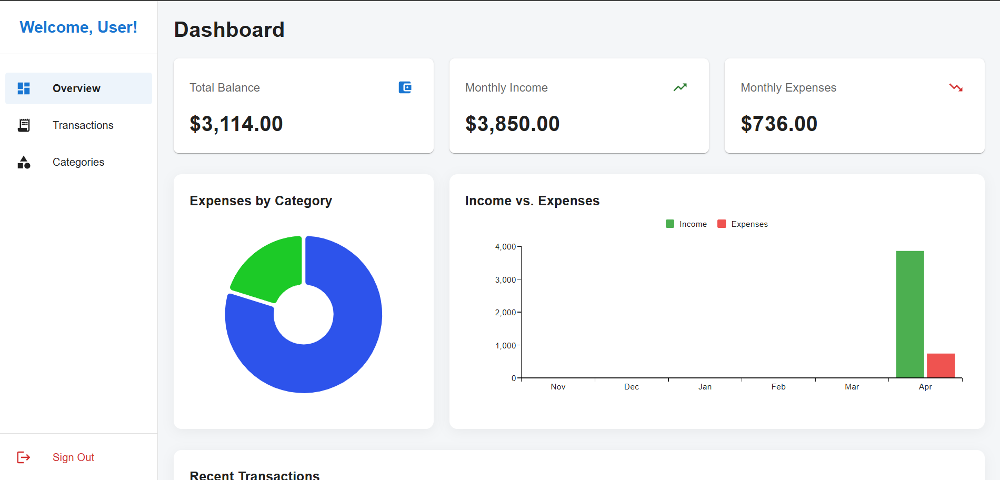
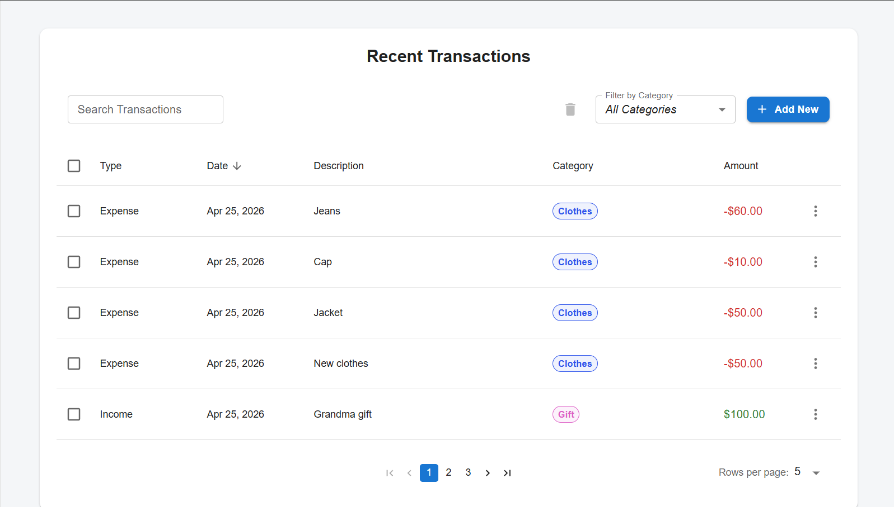
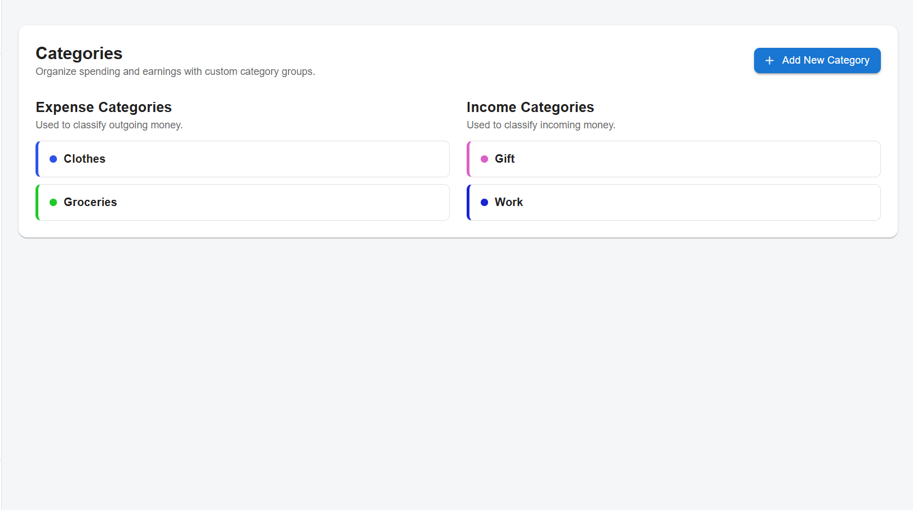

# Finance Dashboard

Live URL: [Paste your Vercel URL here]

Screenshots:

- 
- 
- 

## Overview

Finance Dashboard is a personal finance dashboard for tracking income, expenses, categories, and recent activity in one place.
It includes authentication, transaction management, category management, summary analytics, and responsive dashboard charts.

## Tech Stack

Based on the current package.json dependencies.

### Core

- Next.js 16.2.3
- React 19.2.4
- React DOM 19.2.4
- TypeScript 5

### UI

- Material UI 7.3.9
- MUI Icons 7.3.9
- MUI Next.js integration 7.3.9
- Emotion React 11.14.0
- Emotion Styled 11.14.1
- MUI X Charts 9.0.1
- MUI X Date Pickers 9.0.0

### Backend and Auth

- Supabase SSR 0.10.2
- Supabase JS 2.102.1

### Forms and Validation

- React Hook Form 7.72.1
- Zod 4.3.6
- Hookform Resolvers 5.2.2

### Utilities and Tooling

- date-fns 4.1.0
- ESLint 9
- eslint-config-next 16.2.2

## Features

### Authentication and Session Handling

- User registration with username, email, password, and confirm-password validation
- User login with credential validation and error handling
- Supabase auth integration for client and server
- Route protection and session refresh via middleware/proxy logic
- Logout from dashboard sidebar

### Dashboard Experience

- Responsive dashboard layout with:
  - Permanent sidebar on desktop
  - Mobile app bar + temporary drawer on small screens
- Overview cards for:
  - Total balance
  - Monthly income
  - Monthly expenses
- Responsive chart widgets:
  - Expense distribution pie chart by category
  - Income vs expense bar chart (recent months)
- Recent transactions list with category chips and amount coloring

### Transactions Management

- Search transactions by description
- Filter UI for category selection
- Sortable transaction table columns
- Row selection with bulk selection support
- Delete confirmation flow for destructive actions
- Add and edit transaction modal
- Date picker and form validation

### Categories Management

- Separate Income and Expense category groups
- Add category modal with validation
- Edit category support
- Delete category confirmation flow
- Category color support with hex normalization and preview

### Data Layer

- Centralized data context for transactions and categories
- Shared loading state
- Refresh helpers for transactions, categories, and full refresh
- Supabase queries with user scoping and ordering

## Local Setup

### 1. Clone the repository

- git clone <your-repo-url>
- cd finance-dashboard

### 2. Install dependencies

- npm install

### 3. Create environment variables

Create a file named .env.local in the project root and add:

NEXT_PUBLIC_SUPABASE_URL=your_supabase_project_url
NEXT_PUBLIC_SUPABASE_ANON_KEY=your_supabase_anon_key

### 4. Run the development server

- npm run dev

### 5. Open the app

Go to:

- http://localhost:3000

## Available Scripts

- npm run dev: Start development server
- npm run build: Build for production
- npm run start: Start production server
- npm run lint: Run ESLint

## Deployment

Deploy easily on Vercel:

- Connect the repository
- Add the same environment variables from .env.local in Vercel project settings
- Deploy

## Notes

- This app uses Supabase for authentication and database operations.
- Protected routing is handled through server-side session checks and middleware-style proxy logic.
- UI is built with Material UI and is responsive across desktop and mobile screen sizes.
